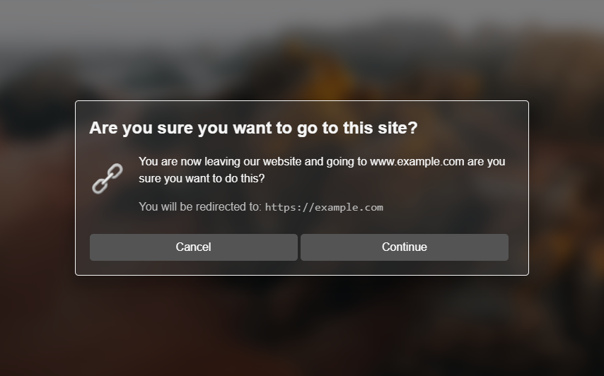

# Consent Message

Get user consent in a way that is both easy and customizable to your needs.

## Usage

Consent messages are at `/consent`. You use the URL perimeters to customize the message.

### Perimeters

| Perimeter | Description |
| --- | --- | --- |
| `title` | The title of the message |
| `description` | The description of the message |
| `link` | Where the browser will be redirected to if the user accepts the message |
| `icon` | The icon that will be displayed on the message (optional) |

### Example

`/consent?title=Example&description=This%20is%20an%20example%20message&link=https://example.com&icon=https://via.placeholder.com/50x50`

[Click here to see the example](https://consent-message.vercel.app/consent?title=Example&description=This%20is%20an%20example%20message&link=https://example.com&icon=https://via.placeholder.com/50x50)
